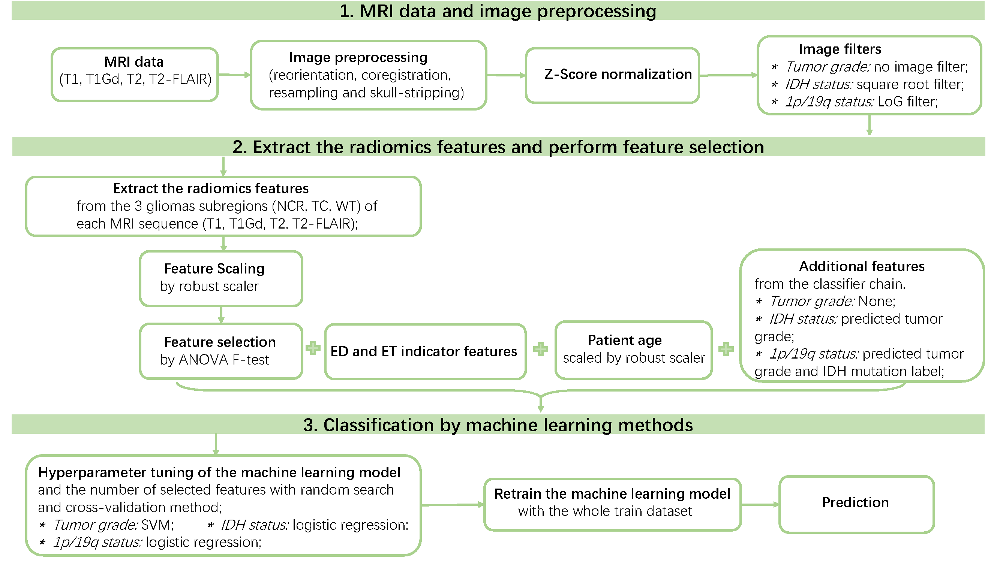

#  Codes for Radiomics/Radiogenomics Analysis.
 
The following figure shows our final radiomics pipeline for predicting each binary classification label (tumor grade, IDH mutation status, and 1p/19q codeletion status) of the gliomas tumor.

  <div align=center></div>

## Citation: 


Please cite the following paper if you use the codes.


```
@article{li_2022_radiomics_for_gliomas_classification,   
  title={Radiomics-Based Method for Predicting the Glioma Subtype as Defined by Tumor Grade, IDH Mutation, and 1p/19q Codeletion},   
  author={Li, Yingping and Ammari, Samy and Lawrance, Littisha and Quillent, Arnaud and Assi, Tarek and Lassau, Nathalie and Chouzenoux, Emilie},   
  journal={Cancers},   
  volume={14},   
  number={07},   
  pages={1778},   
  year={2022},   
  publisher={Multidisciplinary Digital Publishing Institute}  
}
```


## Authors:
Yingping LI: yingpingleee@126.com; yingping.li@universite-paris-saclay.fr;

Samy Ammari; Littisha Lawrance; Arnaud Quillent; Tarek Assi; Nathalie Lassau; Emilie Chouzenoux;


